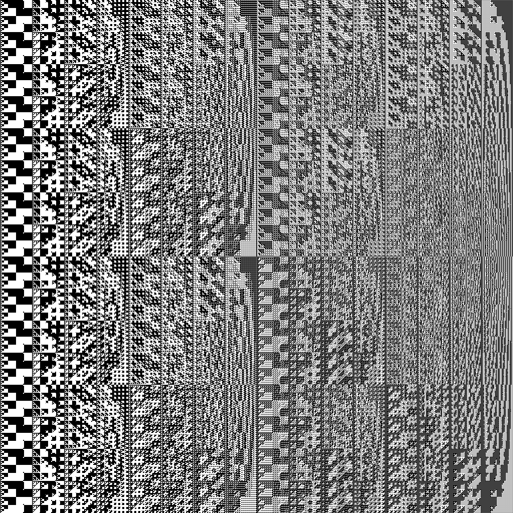
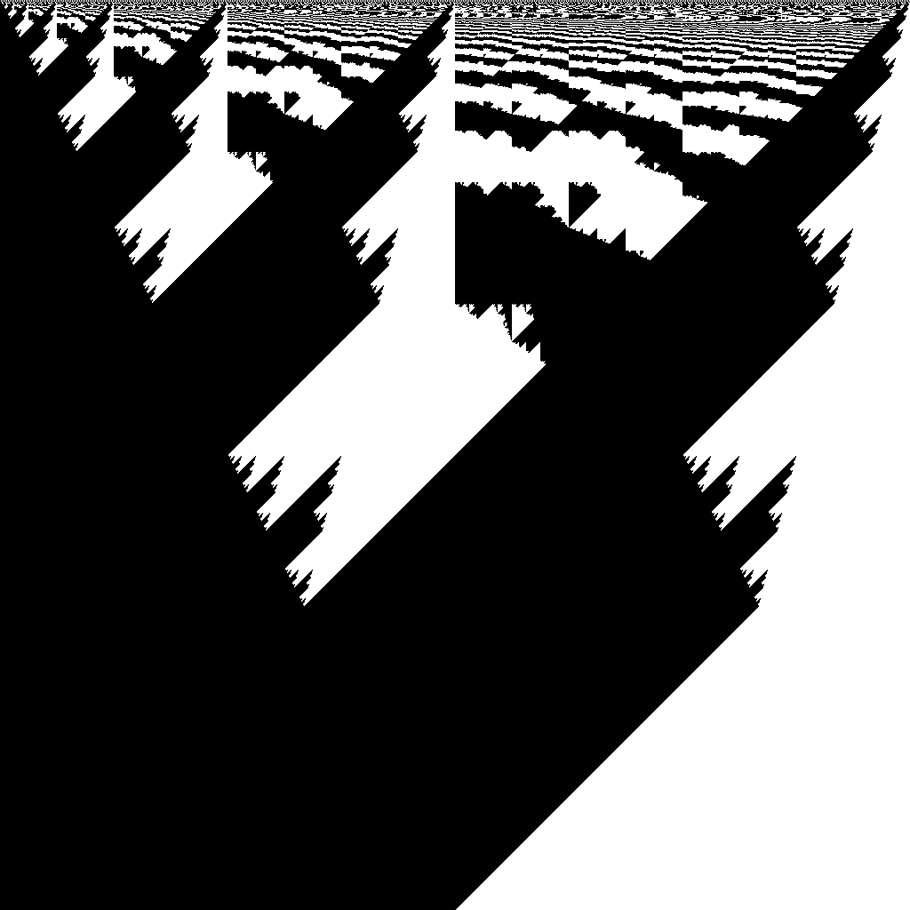
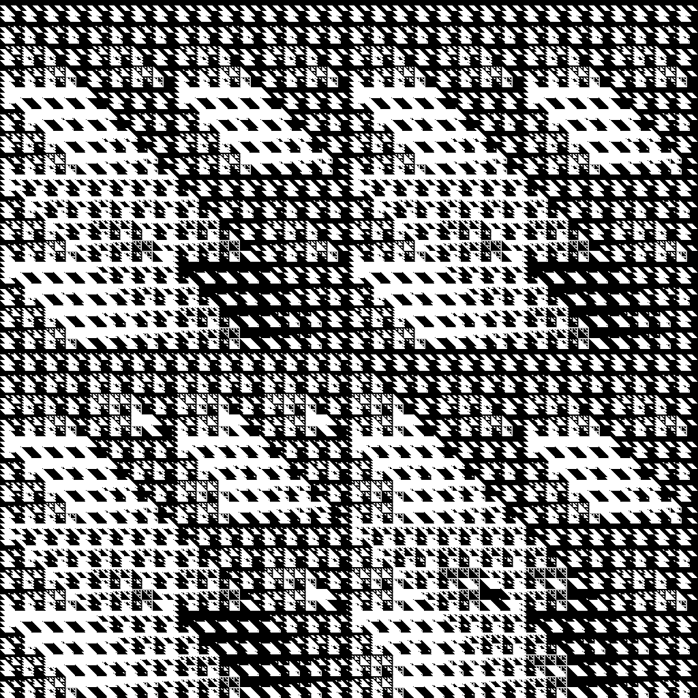
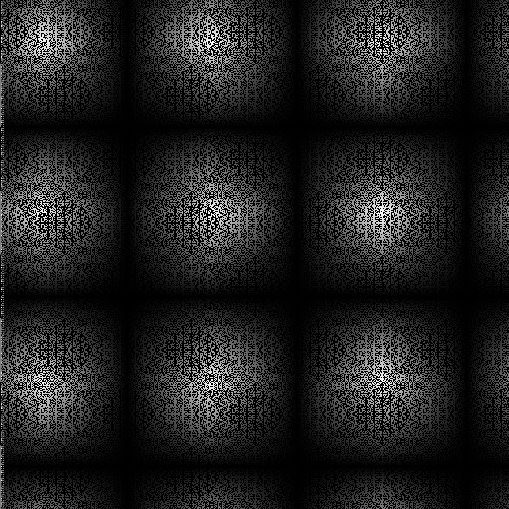
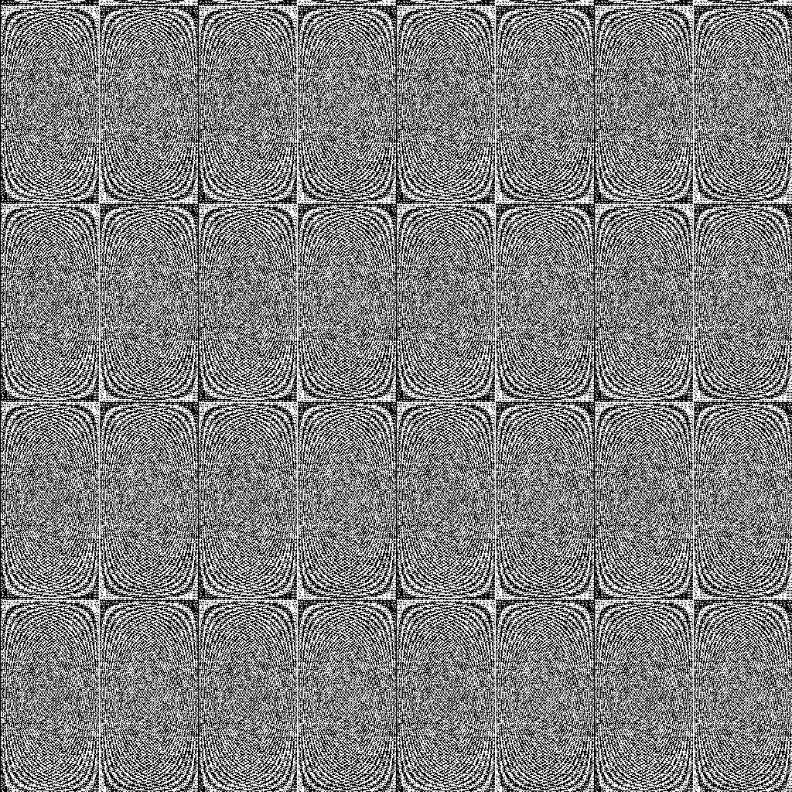
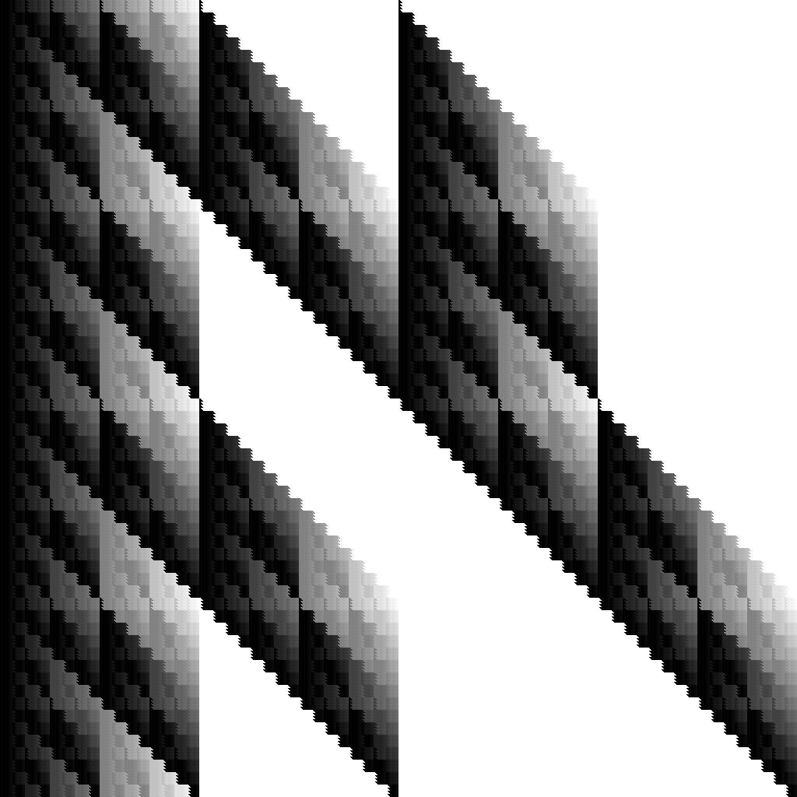
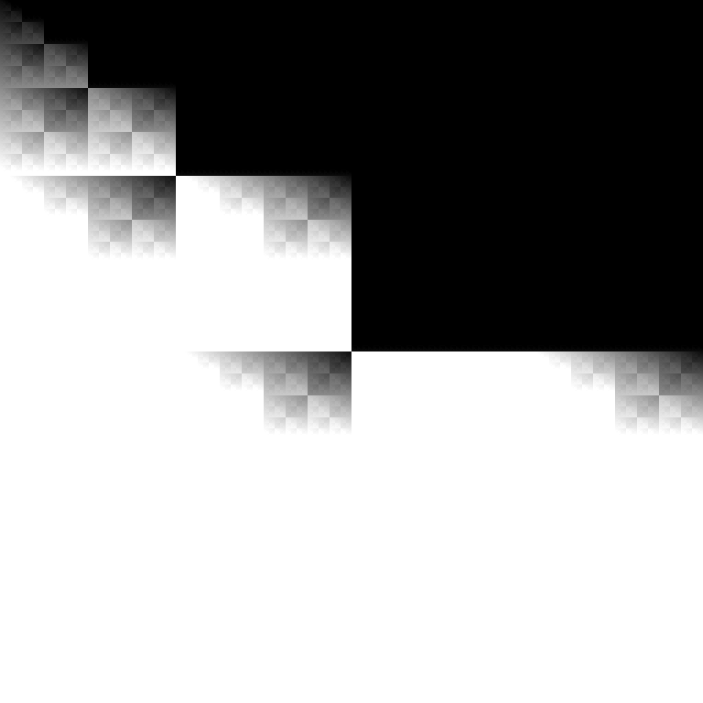

## Generate images from a random pattern

Someone on fractalforums gave me the idea of creating random images based on mathematical operations

This generates a random set of operators and a random set of operands, either x, y or a random number, and composes them into a formula.

It then generates an image using the lowest order bit of the result of that formula for each pixel.

For example, if it generated the formula ((((x ^ y) - y) \* x) >> 11) & 1, then the output would look like this

### Dependencies

Depends on [libpme](https://github.com/nilesr/libpme) (`pip3 install libpme`)

### Usage

	python3 generator.py [mode]

`mode` can be one of `high`, `greyscale`, `modulo`, or `all`. If left blank, it generates an image using the lowest bit of the result of the formula. If set to high, it will use the highest bit of the result. If set to greyscale, it will use the result of the formula as a shade of grey, truncated to one byte for png. modulo is just a special case of greyscale, where instead of truncating the return value, it modulos it by 2^8. If set to all, it will run all 4

### Examples

This is an example with the formula (((((10) >> y) + x) + y) & x) ÷? y

This is an example with the formula (((((x) ^ x) ^ x) - y) & y) ÷? 15

This is what high looks like for the formula ((y) * x) ** x:

and for ((((((y) * y) * 5) ** x) + 7) - y) * x

and this is what it looks like for greyscale with the formula (((((12) | y) - 11) - x) & x) ^ x

and for ((((x) & y) - x) + y) + 11

### Todo

#### Features

Support for unary operators, like bitwise not (~)

Support for detecting if the generated function only depends on one or zero of the position expressions

#### Optimization

Right now, if it generates an expression that starts with a bunch of constants (like ((12) log base? 3) ** 5) it will run those potentially-expensive calculations for each pixel, even though that part of the expression never changes.
That could be optimized
